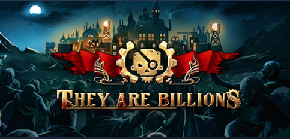
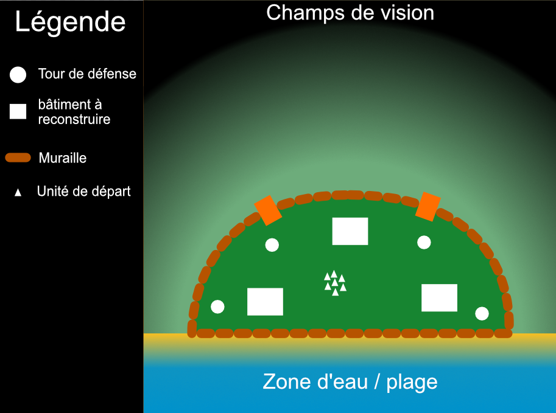

## **Cahier des charges**

AdlezRTS est un jeu typé **RTS** dans lequel vous devrez survivre à de multiple vague pendant un système jour/nuit. Ce jeu est réalisé avec **Unreal Engine 5**

## **Univers**
Utilisation du pack Sci-Fi pour la mise en place de l'univers : https://syntystore.com/collections/frontpage/products/polygon-sci-fi-worlds

## **Source Inspiration**

## **Scénario Tutoriel, Guidage Joueur**
Le village à été ravagé durant la dernière lune, toutes les batiments ont été réduit en poussière sous les coups des adversaire, au lever du soleil
ces derniers parte à la vue du soleil et des renforts alliés arrivant malheuresement trop tard. Pour ce début de jeu le joueur pourra assiter à une petite mise
en scène expliqué au-dessus, lorsque que les adversaires sortent du village le joueur pourra prendre contrôle des unités renforts et sera convié a reconstruire
le village (un des batiments pouvant être reconstruit du village). 

Le jeu sera découpé en deux partie, une en jour et une autre de nuit, il sera expliqué a travers de boite de dialogue ou texte affiché sur l'HUD les étapes à suivre
durant ce cycle.

La période en jour, le joueur devra construire, dépenser ces ressources pour créer des unités ou réparer des batiments permettant la création d'unité spéciale

La période de nuit consiste a survivre à de multiple vagues venant de différent coté du village, chaque adversaire éliminé permettra de gagner de l'argent.

Lorsque toutes les nuits ont été effectué et que le joueur a survécu il sera acceuilli avec un écran de remerciement pour avoir joué a la démo du jeu AdlezRTS

**Étapes:** (Avant chaque étape le jeu sera mis en pause)
 - Montrer le système de séléction par unité ou pour un ensemble avec la séléction multiple en rectangle
 - Cliquer sur un bâtimet avec une ou plusieurs unités séléctionnées le bâtiment principale pour le reconstruire ce qui permet de créer des simples IA
 - Ensuite séléctionner le bâtiment pour créer d'autre IA
 - Construire le bâtiment des troupes d'attaques
 - Générer des troupes d'attaques
 - Placer les troupes pour défendre
 - Reconstruire une tour de défense
 - La Nuit tombe
 - Début de la vague et montrer la séléction d'unité pour attaquer une unité ennemie précisement, ou la plus proche, celle qui à le plus de PV, celle qui est la plus faible, ...
 - Continuer jusqu'à la 10ème vague
 - FIN (Ou mort prématuré : Plus d'unité et de bâtiment en bonne état)

## **Entitées**
**Alliés**
 - Humain builder
 - Humain fighter

**Ennemies**
 - Tank : Monstre qui attaque au corps à corps avec beaucoup de PV et marche lentement
 - Shooter : Monstre qui attaque à distance avec peut de PV

## **Schéma Map**

## **Mécanique principale avec IA Employé**
1. Mécanique Construction/Réparation de batîments
	1.1 Création d'unité
	1.2 Gain d'argent
	1.3 Création de tour
	1.4 Gain Emplacement d'espace
2. Mécanique Achat
	2.1 Unité
	2.2 Batîments
3. Mécanique Unité Allié
	3.1 Flocking pour se répartir sur une zone
	3.2 AI Utility pour déterminer quel unité à attaqué
	3.3 Behaviour Tree
	3.4 Entité 
4. Mécanique Unité Ennemie
	4.1 Behaviour Tree
5. Mécanique Vague / Spawner
	5.1 Fait apparaitre des adversaires
	5.2 Choisi le point d'arrivé du Village (Ouest,Nord,Est)
	

